# ○○○○학교 교복 디자인 및 규격서 (표준 예시)

학교명：○○○○학교

※ 본 규격서 표준 예시는 업체에서 교복 제작에 어려움이 없도록 각급 학교에서 규격서 작성 시 따라야 할 통일된 표준안이며, 학교 상황에 맞게 항목과 내용(섬유 혼용률 등)을 수정하여 사용.

※ 교복 입찰 시 또는 교복 디자인 변경 시 본 규격서 표준 예시처럼 작성(사진 첨부 필수)

## 섬유혼용률 (혼용률 허용범위 土5% 이내)

<table>
<tr><th colspan="2">구분</th><th>섬유 혼용률</th><th>비고</th></tr>
<tr><td rowspan="6">동복</td><td>재킷</td><td>모 80%, 나일론 20%</td><td>캐시미어</td></tr>
<tr><td>셔츠/블라우스</td><td>폴리에스터 75%, 레이온 25%</td><td>모슬린</td></tr>
<tr><td>바지</td><td>폴리에스터 65%, 레이온 30% 우레탄 5%</td><td>링클프리 T/R 스판</td></tr>
<tr><td>치마</td><td>모 60%, 폴리에스터 40%</td><td>젠트라 스판</td></tr>
<tr><td>조끼</td><td>모 50%, 아크릴 50%</td><td>니트류</td></tr>
<tr><td>넥타이</td><td>폴리에스터 100%</td><td>자동타이</td></tr>
<tr><td rowspan="4">하복</td><td>셔츠/블라우스</td><td>폴리에스터 75%, 레이온 25%</td><td>모슬린</td></tr>
<tr><td>생활티</td><td>폴리에스터 100%</td><td>쿨맥스/쿨론</td></tr>
<tr><td>바지/반바지</td><td>폴리에스터 93%, 폴리우레탄 7%</td><td>기능성 쿨스판</td></tr>
<tr><td>스커트</td><td>모 60%, 폴리에스터 40%</td><td>젠트라 스판</td></tr>
<tr><td rowspan="8">생활형</td><td>야구점퍼</td><td>모 80%, 나일로 20%</td><td>캐시미어</td></tr>
<tr><td>후드집업</td><td>면 30%, 폴리에스터 65% 폴리우레탄 5%</td><td>밍크기모/융기모</td></tr>
<tr><td>바람막이 점퍼</td><td>폴리에스터 100%</td><td>바람막이 전용 발수기능 원단</td></tr>
<tr><td>맨투맨</td><td>면 80%, 폴리에스터 20%</td><td>특양면</td></tr>
<tr><td>집업</td><td>면 50%, 폴리에스터 50%</td><td>단보루</td></tr>
<tr><td>동복 생활바지</td><td>면 50%, 폴리에스터 50%</td><td>단보루</td></tr>
<tr><td>하복 라운드형 생활티</td><td>폴리에스터 100%</td><td>쿨맥스/쿨론</td></tr>
<tr><td>생활 반바지</td><td>폴리에스터 100%</td><td>스판 및 구김없는 시원한 소재</td></tr>
<tr><td colspan="2">안감</td><td>폴리에스터 100%</td><td>스판소재(재킷, 바지 , 치마)</td></tr>
</table>

## 제작 시 유의 사항

□ 전년도와 변동 여부

□ (예시1) 전년도와 변동 없음(2,3학년과 동일)

□ (예시2) 전년도에서 동복 상의 후드집업과 하복 하의 생활반바지가 추가되었음

□ 규정 및 유의사항(학교 교복 규정에 반영할 내용 표기)

□ 재킷

□ 허리 둘레선에서 엉덩이 둘레선까지 길이중 2/3선까지 (단분 시접 3cm 이상)

□ 소매 : 성장을 감안하여 소매통을 넉넉히 하고, 길이 시접 3cm 이상

□ 단추를 채우고 양쪽 3cm 이상 여유가 있도록(옆선 시접 2cm 이상)

□ 셔츠(동/하복)

□ 허리 둘레선에서 엉덩이 둘레선까지 길이중 2/3선보다 길게한다.

□ 목 칼라와 소매 카우스 안쪽에 때가 잘 타지 않고 세탁이 용이한 천을 댄다

□ 니트조끼

□ 바지 벨트 선에서 5cm 이상 길게함

□ 바지(동/하복)

□ 길이는 복사뼈 아래로(단분시접 5cm 이상), 바지통은 7.5\~8.0 인치로 함

□ 치마(동/하복)

□ 길이-무릎 위 2cm보다 길게할 것(단분 시접 분량 - 5cm이상)

□ 주름 박음질은 엉덩이 둘레선을 내려오지 않게. (엉덩이 둘레선 위로 약 1\~2cm정도)

□ 생활티(라운드형 생활티 포함)

□ 바지/스커트 벨트 선에서 5cm 이상 길게함

□ 반바지

□ 길이는 무릎 위 2cm, 바지통은 9.0\~9.5 인치로 함

□ 야구점퍼

□ 발수/방풍 기능이 있어야하며

□ 허리 둘레선에서 엉덩이 둘레선까지 길이중 2/3선까지

□ 생활 긴바지(동복/하복)

□ 길이는 복사뼈 아래로(단분시접 3cm 이상), 바지통은 7.0\~8.0 인치로 함

□ 생활 반바지(하복)

□ 길이는 무릎 위 2cm\~4cm, 바지통은 9.0\~9.5 인치로 함

## OOOO학교 교복 디자인 및 규격서

□ 남학생 동복

| 품목 | 디자인 이미지(전,후면) | 원단 및 색상 | 제작시 유의사항 |
| --- | --- | --- | --- |
| 상의(재킷) | 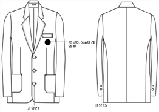 | 1.원단명 혼용률 -캐시미어 -울:나일론 =80:20 2.색상 -진남색 3.안감 -폴리 100% 4.와펜  (가로:세로=5cm:5cm) | 1.디자인 상세 내역 -카라 노치드 정장형 -가슴주머니 학고/아래주머니 아우트 2.단추 -검정단추(학교문양 없음) -앞단추 3개(지름 20mm) -소매단추 2개(지름 15mm) 3.교표(와펜형) -크기(가로:세로 =5cm:5cm) -학고 아래 0.5cm 아래 부착 4.기타사항 -소매시접 4cm 이상 -겉으로 상표 드러나지 않아야함 |
| 셔츠 | 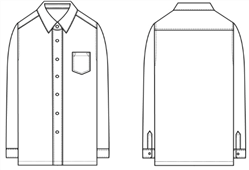 | 1.원단명 혼용률 -모슬린 -폴리:레이온 =75:25 2.색상 -흰색 | 1.디자인 상세 내역 -레귤러/플레인 카라모양 -왼쪽 오각주머니 1개 -사이바 라인 없음, 박스형 2.단추 -앞단추:백색 7개(12mm) -소매단추:백색 2개(12mm) 3.기타사항 - 겉으로 상표 드러나지 않아야함 - 여분단추 필수 |
| 니트조끼 | 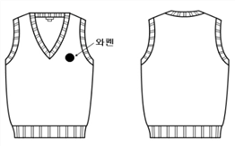 | 1.원단명 혼용률 -니트류 -울:아크릴 =50:50 2.색상 -진남색 3.와펜  (가로:세로=5cm:5cm) | 1.디자인 상세 내역 -카라모양(V-넥,라운드넥 등) -몸판 재직 방식(민무늬) 2.교표(와펜형) -크기(가로:세로 =5cm:5cm) -왼쪽 가슴에 부착 3.기타사항 -소매,목, 밑단 시보리 탄력있게 -겉으로 상표 드러나지 않아야함 |
| 바지 | 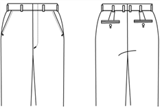 | 1.원단명 혼용률 -T/R 스판 -폴리 65% -레이온 30% -우레탄 5% 2.색상 -진남색 3.안감 -폴리 100% | 1.디자인 상세 내역 -앞주름:노턱 -벨트 구성 방식 √벨트형 허리조절기방식 -바지통 7.5\~8.0인치 -복사뼈 아래 3cm보다 길게 -뒷주머니 2개 2.기타사항 -단분시접 8cm 이상 -겉으로 상표 드러나지 않아야함 |
| 넥타이 | 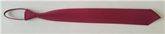 | 자주색 폴리에스터 100% | 1.자동타이 2.넥타이 길이 42cm |

□ 여학생 동복

| 품목 | 디자인 이미지(전,후면) | 원단 및 색상 | 제작시 유의사항 |
| --- | --- | --- | --- |
| 상의(재킷) | 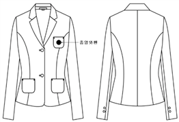 | 1.원단명 혼용률 -캐시미어 -울:나일론 =80:20 2.색상 -진남색 3.안감 -폴리 100% | 1.디자인 상세 내역 -카라 노치드 정장형 -가슴주머니/아래주머니 아우트 -앞뒤 사이바 라인 2.단추 -검정단추(학교문양 없음) -앞단추 2개(지름 18mm) -소매단추 2개(지름 15mm) 3.교표(와펜형) -크기(가로:세로 =5cm:5cm) -왼쪽 가슴주머 중앙 부착 4.기타사항 -소매시접 4cm 이상 |
| 블라우스 | 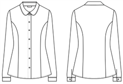 | 1.원단명 혼용률 -모슬린 -폴리:레이온 =75:25 2.색상 -백색 | 1.디자인 상세 내역 -둥근카라 -사이바 라인 있음 2.단추 -앞단추:백색 7개(12mm) -소매단추:백색 2개(12mm) 3.기타사항 -겉으로 상표 드러나지 않아야함 -여분단추 |
| 니트조끼 |  | 1.원단명 혼용률 -니트류 -울:아크릴 =50:50 2.색상 -진남색 3.와펜  (가로:세로=5cm:5cm) | 1.디자인 상세 내역 -카라모양(V-넥,라운드넥 등) -몸판 재직 방식(민무늬) 2.교표(와펜형) -크기(가로:세로 =5cm:5cm) -왼쪽 가슴에 부착 3.기타사항 -소매,목, 밑단 시보리 탄력있게 -겉으로 상표 드러나지 않아야함 |
| 스커트 |  | 1.원단명 혼용률 -젠트라스판 -울:폴리=60:40 2.색상 -회색 3.안감 -폴리 100% | 1.디자인 상세 내역 -앞주름 방식 √앞면 양쪽 외주름 2개 -벨트 구성 방식 √벨트형 허리조절기방식 2.길이 및 주름 박음 -무릎 위 2cm보다 길게할것 -주름 박음은 엉덩이 둘레선 위로 3.기타사항 -단분 시접 5cm 이상 |
| 넥타이 |  | 자주색 폴리에스터 100% | 1.자동타이 2.넥타이 길이 36cm |

□ 남학생 하복

| 품목 | 디자인 이미지(전,후면) | 원단 및 색상 | 제작시 유의사항 |
| --- | --- | --- | --- |
| 상의(셔츠) | 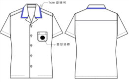 | 1.원단명 혼용률 -몸판:모슬린 -배색:모슬린 -폴리:레이온 =75:25 2.색상 -몸판:흰색 -배색:진남색 3.와펜  (가로:세로=5cm:5cm) | 1.디자인 상세 내역 -남방카라 -카라 끝 1cm 폭 진남색 배색 -왼쪽 밑굴림 주머니 1개 2.단추 -흰색 앞단추 5개(지름 12mm) 3.교표(와펜형) -크기(가로:세로 =5cm:5cm) -왼쪽 가슴주머니 중앙에 부착 4.기타사항 -여분단추 -겉으로 상표 드러나지 않아야함 |
| 생활복 |  | 1.원단명 혼용률 -몸판:쿨맥스 -폴리 100% 2.색상 -몸판:진남색 -배색:파랑체크 3.와펜  (가로:세로=5cm:5cm) | 1.디자인 상세 내역 -셔츠 스텐 카라 -카라끝 1cm 폭 배색 -왼쪽 가슴 오각주머니 -소매끝/주머니/등판 0.3cm폭 띠배색 2.단추 -흰색 앞단추 3개(지름 12mm) 3.교표(와펜형) -크기(가로:세로 =5cm:5cm) -왼쪽 가슴주머니 중앙에 부착 4.기타사항 -여분단추 -겉으로 상표 드러나지 않아야함 |
| 바지 |  | 1.원단명 혼용률 -기능성쿨스판 -폴리:우레탄=93:7 2.색상 -진남색 | 1.디자인 상세 내역 -앞주름:노턱 -벨트 구성 방식 √벨트형 허리조절기방식 -바지통 7.5\~8.0인치 -복사뼈 아래 3cm보다 길게 -뒷주머니 2개 2.기타사항 -단분시접 8cm 이상 -겉으로 상표 드러나지 않아야함 |
| 반바지 |  | 1.원단명 혼용률 -기능성쿨스판 -폴리:우레탄=93:7 2.색상 -진남색 | 1.디자인 상세 내역 -앞주름:노턱 -벨트 구성 방식 √벨트형 허리조절기방식 -바지통 9.0\~9.5인치 -무릎에서 2cm 위보다 길어야함 -뒷주머니 2개 2.기타사항 -단분시접 8cm 이상 -겉으로 상표 드러나지 않아야함 |

□ 여학생 하복

| 품목 | 디자인 이미지(전,후면) | 원단 및 색상 | 제작시 유의사항 |
| --- | --- | --- | --- |
| 상의(셔츠) |  | 1.원단명 혼용률 -몸판:모슬린 -배색:모슬린 -폴리:레이온 =75:25 2.색상 -몸판:흰색 -배색:진남색 3.와펜  (가로:세로=5cm:5cm) | 1.디자인 상세 내역 -플랫 카라 -카라끝 1cm 폭 배색 -가슴주머니 학고 모양 주머니 2.단추 -흰색 앞단추 5개(지름 12mm) 3.교표(와펜형) -크기(가로:세로 =5cm:5cm) -왼쪽 가슴 학고주머니 0.5cm 아래 4.기타사항 - 여분단추 - 겉으로 상표 드러나지 않아야함 |
| 생활복 |  | 1.원단명 혼용률 -몸판:쿨맥스 -폴리 100% 2.색상 -몸판:진남색 -배색:파랑체크 3.와펜  (가로:세로=5cm:5cm) | 1.디자인 상세 내역 -셔츠 스텐 카라 -카라끝 1cm 폭 배색 -왼쪽 가슴 오각주머니 -소매끝/주머니/등판 0.3cm폭 띠배색 2.단추 -흰색 앞단추 3개(지름 12mm) 3.교표(와펜형) -크기(가로:세로 =5cm:5cm) -왼쪽 가슴주머니 중앙에 부착 4.기타사항 -여분단추 -겉으로 상표 드러나지 않아야함 |
| 스커트 |  | 1.원단명 혼용률 -젠트라스판 -울:폴리=60:40 2.색상 -진남색 3.안감 -폴리 100% | 1.디자인 상세 내역 -앞주름 방식 √앞면 양쪽 외주름 2개 -벨트 구성 방식 √벨트형 허리조절기방식 2.길이 및 주름 박음 -무릎 위 2cm보다 길게할것 -주름 박음은 엉덩이 둘레선 위로 3.기타사항 -단분 시접 5cm 이상 |
| 반바지 |  | 1.원단명 혼용률 -기능성쿨스판 -폴리:우레탄=93:7 2.색상 -진남색 | 1.디자인 상세 내역 -앞주름:노턱 -벨트 구성 방식 √벨트형 허리조절기방식 -바지통 9.0\~9.5인치 -무릎에서 2cm 위보다 길어야함 -뒷주머니 2개 2.기타사항 -단분시접 8cm 이상 -겉으로 상표 드러나지 않아야함 |

□ 남·여학생 편한교복(1)

| 품목 | 디자인 이미지(전,후면) | 원단 및 색상 | 제작시 유의사항 |
| --- | --- | --- | --- |
| 야구점퍼 | 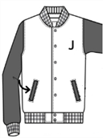 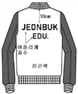 | 1.원단명 혼용률 -캐시머어 -울:나일론=80:20 2.색상 -몸판:진남색 -소매:회색 -시보리:진남색/흰색2줄 3.안감 -진남색 퀼팅안감 -폴리 100% | 1.디자인 상세 내역 -진남색 퀼팅 안감 -소매 회색 배색 -시보리:카라/소매끝/밑단 진남색/흰색 2줄 -주머니 모양(입술주머니) -주머니 지퍼 있음 2.단추 또는 지퍼 -흰색 도트 단추, 지퍼 없음 3.교표 및 교명(자수) -왼쪽 가슴 'J'흰색 어플리케 자수 :크기(가로:세로=4.5cm:10cm) -등판'JEONBUK'흰색 어플리케 자수 :크기(가로:세로=35cm:10cm) -등판'EDU.'흰색 어플리케 자수 :크기(가로:세로=16cm:8cm) |
| 후드집업 | 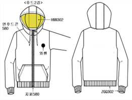 | 1.원단명 혼용률 -밍크기모 -면:폴리:우레탄=30:65:5 2.색상 -몸판:검정 -시보리:검정 3.와펜  (가로:세로=5cm:5cm) | 1.디자인 상세 내역 -후드집업(후드 안쪽 검정 내피) -왼쪽 가슴 교표 위치 -캥거루 주머니 위 2줄 박음 -주머니 지퍼 없음 2.지퍼 및 후드끈 -지퍼/후드끈 검정색 -후드끈 매듭 처리 3.교표(와펜형) -크기(가로:세로 =5cm:5cm) -왼쪽 가슴에 부착 4.기타사항 -3년간 착용할 수 있도록 넉넉히 |
| 바람막이점퍼 | 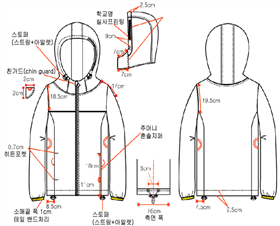 | 1.원단명 혼용률 -바람막이 전용 발수기능 원단 -폴리 100% 2.색상 -몸판:진남색 -배색:흰색 -시보리:진남색 3.와펜  (지름 4.5cm) | 1.디자인 상세 내역 -어깨선부터 아래 19.5cm 폭 흰색 배색 -지퍼 진남색 -카라/소매끝/밑단 시보리 -모자 스토퍼/아일릿 처리 2.단추 또는 지퍼 방식 표기 -진남색 지퍼 -아래 양쪽 주머니(지퍼 있음) 3.교표(와펜형) -왼쪽 가슴 교표 위치 -크기(지름 4.5cm 원형) 4.기타사항 -3년간 착용할 수 있도록 넉넉히 |

□ 남·여학생 편한교복(2)

| 품목 | 디자인 이미지(전,후면) | 원단 및 색상 | 제작시 유의사항 |
| --- | --- | --- | --- |
| 맨투맨 | 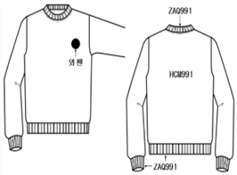 | 1.원단명 혼용률 -특양면 -면:폴리=80:20 2.색상 -몸판:진남색 -시보리:진남색 3.와펜  (지름 4.5cm) | 1.디자인 상세 내역 -라운드형 2.교표(와펜형) -왼쪽 가슴 교표 위치 -크기(지름 4.5cm 원형) 3.기타사항 -3년간 착용할 수 있도록 넉넉히 |
| 집업 | 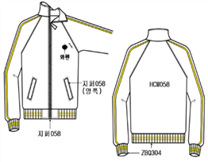 | 1.원단명 혼용률 -단보루 -면:폴리=50:50 2.색상 -몸판:진남색 -흰줄 띠배색 3.와펜  (지름 4.5cm) | 1.디자인 상세 내역 -소매 위 흰색 1cm 폭 띠 배색 -입술주머니(지퍼있음) -아래 시보리 흰색 2줄 배색 2.교표(와펜형) -왼쪽 가슴 교표 위치 -크기(지름 4.5cm 원형) 3.기타사항 -3년간 착용할 수 있도록 넉넉히 |
| 생활바지 | 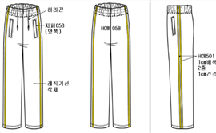 | 1.원단명 혼용률 -단보루 -면:폴리=50:50 2.색상 -몸판:진남색 -흰줄 띠배색 | 1.디자인 상세 내역 -밴드형(스트링끈 진남색) -1cm 폭 배색 2줄 1cm 간격 -입술주머니(지퍼있음) -바지통 7.0\~8.0인치 -복사뼈 아래 3cm보다 길게 2.기타사항 -3년간 착용할 수 있도록 넉넉히 |

□ 남·여학생 편한교복(3)

| 품목 | 디자인 이미지(전,후면) | 원단 및 색상 | 제작시 유의사항 |
| --- | --- | --- | --- |
| 라운드형 생활티 | 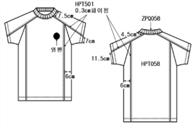 | 1.원단명 혼용률 -쿨맥스 -폴리 100% 2.색상 -몸판:진남색 -흰색 띠배색 3.와펜  (지름 4.5cm) | 1.디자인 -어깨/옆구리 0.3cm 폭 띠 배색 2.교표(와펜형) -왼쪽 가슴 교표 위치 -크기(지름 4.5cm 원형) 3.기타사항 -3년간 착용할 수 있도록 넉넉히 |
| 생활반바지 | 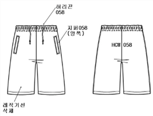 | 1.원단명 혼용률 -ATB-기능성 -폴리 100% 2.색상 -검정색 | 1.디자인 상세 내역 -밴드형 벨트(스트링끈 검정) -입술주머니(지퍼 있음) -바지통 9.0\~9.5인치 -무릎에서 2cm 위보다 길어야함 2.기타사항 -3년간 착용할 수 있도록 넉넉히 |

□ 남·여학생 교복/편한교복 사진(1)

<table>
<tr><th>남학생(동복)</th><th colspan="2">여학생(동복)</th><th colspan="2">남학생(춘추복)</th><th>여학생(춘추복)</th></tr>
<tr><td>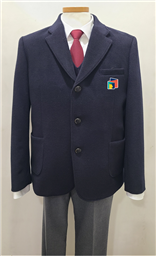</td><td colspan="2">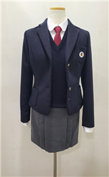</td><td colspan="2">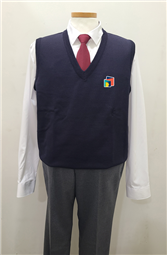</td><td>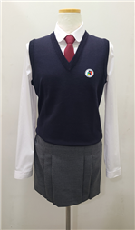</td></tr>
<tr><td colspan="2">남학생(하복)</td><td colspan="2">여학생(하복)</td><td colspan="2">남녀학생(생활티)</td></tr>
<tr><td colspan="2">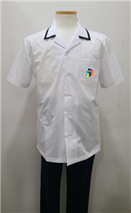</td><td colspan="2">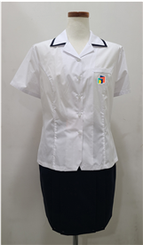</td><td colspan="2">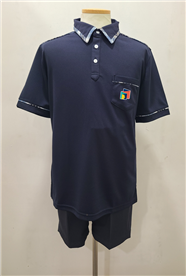</td></tr>
<tr><td colspan="6">생활형(야구점퍼)</td></tr>
<tr><td colspan="3">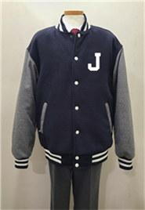</td><td colspan="3">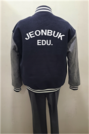</td></tr>
</table>

□ 남·여학생 교복/편한교복 사진(2)

<table>
<tr><th colspan="2">후드집업</th><th colspan="2">바람막이 점퍼</th><th colspan="2">맨투맨</th></tr>
<tr><td colspan="2">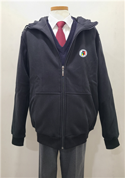</td><td colspan="2">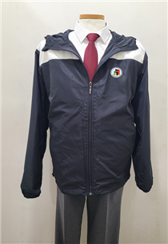</td><td colspan="2">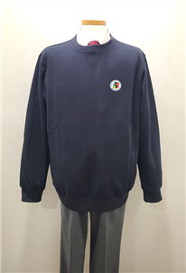</td></tr>
<tr><td colspan="3">동복 집업/동복 생활바지</td><td colspan="3">하복 라운드티/생활 반바지</td></tr>
<tr><td>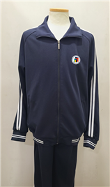</td><td colspan="2">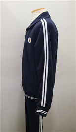</td><td colspan="2">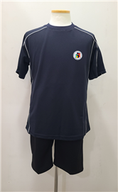</td><td>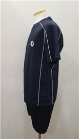</td></tr>
</table>