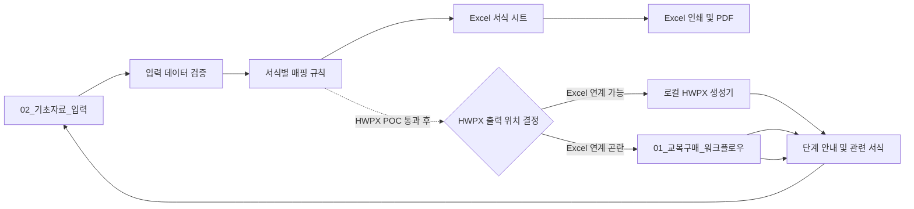

# 계획.md — 교복구매 길라잡이 Excel MVP 및 웹앱 전환

- **상태**: `IN_PROGRESS — P1-03 데이터 모델·매핑 완료, P1-04 결정 대기`
- **작성일**: 2026-09-15
- **우선순위**: Excel/PDF MVP → HWPX 자동화 검증 → 현장 검증 → 웹앱
- **원본 보존 원칙**: 제공된 `.hwpx`·`.xlsm` 원본은 읽기 전용으로 취급하고, 모든 분석·변환·생성은 사본과 별도 산출물에서 수행함.

> **핵심 결론:** Excel의 단일 기초자료 입력과 선택 출력은 바로 설계할 수 있으나, **Excel에서 HWPX를 자동 생성하는 방식은 아직 결정·검증되지 않았음.** 이 경계를 확정하지 않은 상태에서 서식 57종 전체를 구현하면 재작업 위험이 큼.

---

## 1. 목표 및 범위

### 1.1 최종 목표

학교 교사와 행정실 직원이 교복 학교주관구매의 업무단계를 따라가며, 공통 기초자료를 한 번 입력하고 필요한 공문·계약서·평가표·가정통신문·설문지·검수서식을 선택하여 Excel, PDF 및 검증된 범위의 HWPX로 출력할 수 있는 도구를 구축함.

### 1.2 단계별 제공 범위

| 단계 | 제공물 | 범위 |
|---|---|---|
| 1단계 | Excel MVP | 워크플로우, 기초자료 입력, 확정 인벤토리의 전체 서식(사용자 목표 57종), Excel 인쇄/PDF |
| 2단계 | HWPX POC | 대표 3종 템플릿화 및 값 치환·재열기·레이아웃 검증 |
| 3단계 | Excel/HWPX 확대 | Excel 출력은 순차 확장하고, Excel에서 HWPX 출력이 어려우면 승인된 HWPX 생성 기능을 웹앱으로 이관 |
| 4단계 | 웹앱 MVP | 절차 안내, 입력, 문서 생성·다운로드; Excel HWPX 출력 난항 시 HWPX 출력의 대체 구현 경로 |

### 1.3 MVP에서 제외하는 항목

- 학생별 이름·치수·주문·설문 원자료의 저장 및 통합 관리
- 직인·서명 이미지의 자동 삽입 및 보관
- 계약 문구·법령·금액기준을 근거 없이 자동 판정하거나 임의 변경하는 기능
- 기존 XLSM의 외부 연결, 깨진 이름 정의, 매크로를 그대로 복사하는 방식
- HWPX 생성 방식이 검증되기 전의 웹 브라우저 내 HWPX 생성 약속

---

## 2. 검토 결과와 반영 사항

### 2.1 확인한 사실

| 대상 | 확인 결과 | 계획 반영 |
|---|---|---|
| 교복 매뉴얼 HWPX | Kordoc `validate` 구조 검증 통과, 섹션 XML 1개, `BinData` 항목 46개 | 서식 경계는 장/섹션 수가 아닌 문단·표·이미지 배치 순서로 판별함 |
| 기존 XLSM | 워크시트 XML 11개, VBA 프로젝트 존재, 외부 링크 항목 2개, 연결 설정 존재 | 기능만 벤치마킹하고 외부 의존성·VBA를 클린룸 방식으로 재구현함 |
| 사전리서치 | 22종 자동인식과 사용자가 언급한 57개가 불일치하며 일부 외부 사례는 미확인 표시됨 | 인벤토리 확정 전에는 서식 수를 일정·완료조건으로 고정하지 않음 |
| HWPX 템플릿 | 원본에 `{{변수명}}` 표식이 있다고 확인되지 않음 | 복사본 3종에서 템플릿화 가능성부터 실증함 |

### 2.2 코드리뷰어 핵심 권고 반영

1. **P0 — 출력 책임 분리**: Excel XLSM은 입력·검증·미리보기·Excel/PDF 출력과 로컬 보조도구 호출을 담당하고, HWPX는 별도 POC에서 확정한 생성기만 담당함.
2. **P0 — 템플릿화 선행**: HWPX 대량 구현 전에 대표 3종에서 변수 표식, 반복 표, 저장·재열기, 한컴 열기, PDF 결과를 검증함.
3. **P0 — 인벤토리 기준 통일**: 서식, 템플릿, 이미지 자산, 이미지 배치, 참고자료를 서로 다른 수치로 관리함.
4. **P1 — 데이터 모델 선행**: 공통값·문서별 값·반복행·계산값·문서 버전과 매핑 규칙을 분리함.
5. **P1 — 골든 테스트 도입**: 정상·누락·최대길이·복수 업체/위원 입력을 기준 데이터로 고정하고, 승인된 Excel/HWPX/PDF 결과와 비교함.
6. **P1 — 보안 경계 설정**: 개인·계약정보·직인은 최소수집, 저장금지 또는 보유목적·기간·마스킹 규칙을 명시한 뒤에만 취급함.

---

## 3. 목표 아키텍처 초안

### 3.3 실행 하네스

| 구분 | 구성 | 적용 역할 |
|---|---|---|
| 실행 모드 | 하이브리드(병렬 분석 + 순차 구현·검증) | 독립 분석은 병렬 수행하고, HWPX POC→XLSM 구현→품질 검증은 선행 산출물을 넘김 |
| 분석 에이전트 | `uniform-workflow-analyst` | 매뉴얼·서식 인벤토리·근거·입력필드 분석 |
| 문서자동화 에이전트 | `document-automation-engineer` | Kordoc POC, HWPX 템플릿화·생성·검증 |
| Excel 에이전트 | `excel-automation-engineer` | XLSM 워크플로우·자동반영·선택출력 구현 |
| 품질 에이전트 | `quality-compliance-reviewer` | 출력·회귀·개인정보·배포 전 독립 검토 |
| 오케스트레이터 | `.claude/skills/uniform-purchase-orchestrator/SKILL.md` | 계획 기반 재개, 산출물 전달, 차단 항목 관리 |
| Goal 운영 스킬 | `.claude/skills/uniform-purchase-goal/SKILL.md` | `/goal` 조건 작성·상태 확인·복구 절차 |

중간 산출물은 `_workspace/00_input`~`04_qa`, 최종 생성 문서는 `artifacts/excel`, `artifacts/hwpx`, `artifacts/pdf`에 보관함.

### 3.1 Excel MVP 워크북 구성

| 시트 | 역할 | 구현 원칙 |
|---|---|---|
| `01_교복구매_워크플로우` | 9단계 흐름, 단계별 체크리스트·서식 이동 | 하이퍼링크 우선, 매크로 버튼은 승인 후 사용 |
| `02_기초자료_입력` | 학교·사업·일정·단가 등 공통 정보 입력 | 입력/자동계산 셀 구분, 유효성 검사 적용 |
| `03_서식선택_출력` | 단계별 서식 선택·필수값 누락·인쇄 대상 확인 | Form ID, 출력 유형, 누락 상태를 표시 |
| `Fxx_서식명` | 원본을 실무 출력 수준으로 재현한 개별 서식 | 공통 필드 Named Range 또는 테이블 참조 |
| `DB`, `Ref_data`, `학교정보`, `서식Metadata` | 코드·드롭다운·매핑·버전 관리 | 일반 사용자 수정 방지, 외부 링크 0개 |
| `Print_sheet` | 선택한 서식의 인쇄 작업 영역 | 대표서식 출력 검증 후 필요 시 구성 |
| `사용설명서` | 설치·입력·출력·오류 대응 | Windows, Microsoft 365, 한컴오피스 및 XLSM 매크로 허용 절차 명시 |

### 3.2 데이터 모델 최소 단위

| 영역 | 핵심 데이터 | 모델링 원칙 |
|---|---|---|
| 기준정보 | 학교, 학년도, 담당자, 결재권자 | 기준값과 문서 발행 시점 값을 분리 |
| 사업 | 품목, 동복/하복, 상한가, 예정수량, 일정 | 표시값·계산값·확정값을 분리 |
| 절차 | 단계, 담당, 마감일, 체크리스트 | 단계 상태와 예외 사유를 기록 가능하게 설계 |
| 계약 | 입찰, 업체, 낙찰, 계약, 납품 | 업체·계약·품목은 반복행 테이블로 처리 |
| 평가·검수 | 위원, 항목, 점수, 검수 항목 | 가변 행 수를 단일 셀 참조로 고정하지 않음 |
| 문서 | Form ID, 원본 버전, 변수, 매핑, 출력 형식 | 원본·생성본·승인기준의 추적성 확보 |

---

## 4. 단계별 실행 계획

상태값: `TODO` / `IN_PROGRESS` / `BLOCKED` / `DONE`

| ID | 단계 | 작업 | 입력자료 | 산출물 | 완료조건(DoD) | 검증방법 | 상태 | 위험요인 |
|---|---|---|---|---|---|---|---|---|
| P0-01 | 준비 | 원본 파일 무결성·사본 작업 폴더 확정 | HWPX, XLSM, 조사자료 | 작업대상 목록 | 원본 5개 이상 읽기 전용 확인, 사본 경로 기록 | 파일 열기·해시 또는 구조검증 | DONE | 원본 덮어쓰기 |
| P0-02 | 준비 | Kordoc 실제 기능 및 제한 확인 | HWPX, Kordoc | `kordoc_기술검증.md` | 파싱·필드탐색·fill dry-run·patch·validate·render 가능 범위 기록 | 샘플 사본으로 명령 결과 확인 | DONE | 명령 인코딩/한글 경로, 원본 서식 손실 |
| P0-03 | 준비 | XLSM 벤치마크 기능·의존성 분류 | XLSM | `엑셀_벤치마크_분석.md` | 시트·이름정의·외부링크·연결·VBA·인쇄 흐름을 재사용/개선/제외로 분류 | Office 또는 OOXML/VBA 정적 분석 | DONE | 외부 통합문서·연결·매크로 경고 전파 |
| P1-01 | 인벤토리 | HWPX 문단·표·이미지 배치 순서 추출 | HWPX 사본 | `_workspace/01_analysis/HWPX_원시구조_목록.md` | 전체 문단·표·이미지 참조를 순서대로 추출 | 원본 페이지와 표본 대조 | DONE | 표·이미지 기반 서식 경계 오인 |
| P1-02 | 인벤토리 | 서식·참고자료·이미지 분리 및 Form ID 부여 | P1-01 | `서식_인벤토리.md` | 각 서식의 단계, 담당, 유형, 원본위치, 표·이미지 여부, 난이도, MVP 여부 기록 | 누락·중복 Form ID 검사, 업무담당자 표본 확인 | DONE | 22/57개 불일치 |
| P1-03 | 모델 | 공통·문서별·반복·계산 필드와 검증 규칙 정의 | P1-02 | `입력데이터_사전.md`, `서식_매핑표.md` | 모든 MVP 서식에 입력 출처·필수여부·형식·매핑 대상 기록 | 필드 누락·중복·개인정보 점검 | DONE | 모든 정보를 공통값으로 오인 |
| P1-04 | 결정 | 전체 서식 범위·HWPX POC 3종·문서 검토 책임 확정 | P1-02, P1-03 | `결정사항.md` | 실제 인벤토리에서 확정한 전체 서식이 57종 목표와 대조되고, POC 3종은 단순공문·반복/계산·복합표 유형을 포괄 | 사용자 확인 및 업무·계약 담당 검토 | TODO | 22종 자동인식과 57종 목표의 차이 |
| P2-01 | HWPX POC | 대표 3종 복사본을 템플릿화하고 값 치환 시험 | P1-04 | 템플릿 사본·`kordoc_기술검증.md` | 반복 표 포함 값 치환, 새 파일 저장·재열기 성공 | Kordoc validate, 원본/결과 비교 | BLOCKED | 표식 부재, 반복셀 치환 오류 |
| P2-02 | HWPX POC | 생성본의 한컴 열기·PDF 비교·사람 검토 | P2-01 | 골든 HWPX/PDF | 결재란·병합표·글꼴·페이지·특수문자 검토 통과 | 한컴 수동 열기, PDF 육안 비교 | BLOCKED | Kordoc 출력과 한컴 조판 차이 |
| P2-03 | 결정 | HWPX 출력 아키텍처 ADR 확정 | P2-01, P2-02 | `ADR-001-HWPX출력방식.md` | Excel 연계 가능 여부를 실증하고, 곤란하면 웹앱 HWPX 생성 경로·보안 경계를 결정 | 설치·보안·유지보수·학교망·개인정보 기준 비교 | BLOCKED | `.xlsx`와 자동 호출 요구 충돌 |
| P3-01 | Excel MVP | 워크플로우·기초자료·참조 데이터 UI 설계 | P1-03, P1-04 | Excel XLSM 초안 | 단계 클릭 이동, 필수값·날짜·목록 검증, 외부링크 0개, 입력값 초기화 버튼 설계 | Windows Microsoft 365에서 대표 사용자 흐름 수동 테스트 | BLOCKED | 매크로 신뢰 정책 |
| P3-02 | Excel MVP | 전체 확정 서식의 Excel 시트·출력 선택 기능 구현 | P3-01 | 승인된 `.xlsm` | 공통값 자동반영, 단계별·개별 선택 인쇄, 페이지 잘림 없음 | 골든 데이터와 Excel/PDF 비교 | BLOCKED | 복합표의 Excel 재현 한계, 57종 범위에 따른 검증량 증가 |
| P3-03 | Excel MVP | 골든 테스트·사용설명서·배포 패키지 작성 | P3-02 | `test.md`, `체크리스트.md`, 사용설명서 | 정상/누락/최대길이/복수행 케이스와 57종 출력 목록 통과 | 회귀·부정·인쇄 테스트 | BLOCKED | 매크로 보안 정책 |
| P4-01 | 현장 검증 | 학교 담당자 시나리오 검증 및 결함 수정 | P3-03 | `로그.md`, 개선판 | 신규 담당자도 5개 대표서식 생성 완료 | 관찰기반 사용성 테스트 | TODO | 실제 업무 절차와 문서 책임 불일치 |
| P5-01 | 웹 설계 | 웹 요구사항·기술·개인정보 ADR 확정 | Excel/HWPX 검증 결과 | `prd.md`, 웹 ADR | Excel HWPX 출력 곤란 시 웹앱 HWPX 생성 경로와 정적 웹·서버리스·DB 도입 기준을 확정 | 비용·접근성·보안·운영성 비교 | TODO | 정적 웹의 HWPX 생성 가능성을 추정함 |
| P5-02 | UX/UI | 업무 흐름 중심 Wireframe·디자인 시스템·접근성 검토 | P5-01 | `웹앱_UX설계.md` | 단계 안내, 관련 서식, 누락 표시, 다운로드 흐름 정의 | 키보드·명도·처음 사용자 시나리오 점검 | TODO | 관리형 SaaS 화면으로 과도하게 복잡해짐 |
| P5-03 | 웹 MVP | 검증된 데이터 모델 및 출력 방식으로 구현·배포 | P5-01, P5-02 | 웹앱·운영문서 | 업무 흐름→입력→검증→PDF 다운로드 및 Excel 대체 HWPX 다운로드 시나리오 통과 | 자동검사·수동 시나리오·배포 검증 | TODO | 개인정보 서버 전송·문서 생성 장애 |

---

## 5. 품질 및 보안 게이트

### 5.1 통과 기준

- 새 Excel 파일은 외부 링크·외부 연결·`#REF!` 이름 정의가 각각 0건임.
- 각 대표서식은 공통 필드 누락 없이 반영되고, 문서별 전용 필드는 다른 서식을 오염시키지 않음.
- 필수값 누락, 날짜 역전, 수량·단가 불일치, 위원 중복, 빈 반복행을 차단하거나 명확히 표시함.
- Excel PDF와 HWPX PDF는 별도 기준본으로 관리하고, 결재란·병합표·체크박스·페이지 잘림을 확인함.
- HWPX는 `validate` 통과만으로 완료 처리하지 않으며, 한컴 열기 및 업무담당자 검토를 함께 통과해야 함.
- 배포 전 공문·계약 문구와 서식 구조는 행정실 직원이 최종 확인함. 배포본에는 자동 생성 결과의 사실관계·계약조건·결재사항을 확인한 뒤 출력한다는 안내를 표시함.

### 5.2 개인정보 및 보안 원칙

| 데이터 구분 | MVP 처리 원칙 |
|---|---|
| 학생·학부모 개인식별·치수·설문 원자료 | 수집·저장·웹 전송 제외 |
| 교직원·평가위원·업체 연락처 | 필요한 모든 정보를 문서 출력에 반영하되, 별도 중앙 저장·출력이력 저장 없이 해당 XLSM 작업본에서만 처리함 |
| 계좌·사업자·계약 정보 | 문서 출력에 필요한 값을 반영하되, 로그·채팅·버전관리 저장소에 노출하지 않음 |
| 직인·서명 | 자동 처리 제외; 별도 보관·권한·승인 체계 마련 전까지 수동 처리 |
| Excel 매크로 | 필요성·신뢰 위치·디지털 서명·악성 매크로 대응 안내를 확정한 경우에만 사용 |

---

## 6. 최초 요구사항 확정 결과

다음 확정사항을 기준으로 인벤토리와 기술검증을 진행한 뒤 `prd.md`, `task.md`, `로드맵.md`, `test.md`, `체크리스트.md`, `로그.md`를 생성·갱신함. 단, XLSM 파일을 저장하면 입력값이 파일에 남을 수 있으므로 출력 후 `입력값 초기화` 기능과 사용 절차를 제공함. 별도 서버·중앙 저장소·출력이력은 MVP에 두지 않음.

| 결정 ID | 결정할 내용 | 기본 권고안 | 상태 |
|---|---|---|---|
| D1 | 1차 MVP 서식 범위 | 실제 인벤토리로 확정되는 전체 서식; 사용자 목표 57종 모두 포함 | CONFIRMED |
| D2 | Excel 배포 형식 | `.xlsm` 허용 | CONFIRMED |
| D3 | HWPX 출력 실행 방식 | 대표 3종 POC 후 학교 PC의 로컬 보조도구를 우선 적용 | CONFIRMED |
| D4 | 대상 PC 환경 | Windows + Microsoft 365 + 한컴오피스 설치 환경 | CONFIRMED |
| D5 | 데이터 범위·처리 방식 | 문서 출력에 필요한 정보는 모두 반영, 중앙 저장 없이 휘발성 운영; 학생·학부모 정보 및 직인 자동처리는 제외 유지 | CONFIRMED |
| D6 | 공문·계약서 최종 검토 책임 | 행정실 직원이 자동 생성 결과의 사실관계·계약조건·서식 상태를 최종 확인 | CONFIRMED |

---

## 7. 변경 이력

| 일자 | 변경 | 근거 |
|---|---|---|
| 2026-09-15 | 초안 작성 | 사용자 최초 요구, 사전리서치, PM-Agent 프롬프트, 기존 계획 초안, 코드리뷰어 검토, HWPX/XLSM 읽기 전용 구조 확인 |
| 2026-09-15 | HWPX 자동출력 선결 조건과 XLSM 클린룸 원칙 추가 | 코드리뷰: 템플릿 표식·호출 방식 미확정, XLSM 외부 연결 존재 |
| 2026-09-15 | 1차 범위를 전체 서식(57종 목표), XLSM 사용, 로컬 HWPX 보조도구, Windows/Microsoft 365/한컴 환경으로 확정 | 요구사항 확정 인터뷰 답변 |
| 2026-09-15 | 자동 생성 공문·계약서의 최종 확인 책임자를 행정실 직원으로 확정 | 요구사항 확정 인터뷰 답변 |
| 2026-09-15 | Harness 플러그인과 교복구매 전용 4개 에이전트·2개 스킬·중간/최종 산출물 디렉터리 구성 | 하네스 구성 요청 및 Claude Code Goal 공식 문서 확인 |
| 2026-09-15 | Excel HWPX 출력이 기술·운영상 곤란할 경우, HWPX 기능을 웹앱 출력 경로로 이관하는 대체 경로 추가 | 사용자 결정 |

---

## 8. 다음 작업

1. P0-02·P0-03을 완료하고 실제 서식 수·외부 의존성을 확정함.
2. P1 인벤토리·데이터 사전·서식 매핑표를 작성하여 57종 목표와 실제 개수를 대조함.
3. 전체 서식 구현 전 P2의 대표 3종 HWPX POC를 통과시킴.
4. HWPX POC 통과 후 P3에서 전체 확정 서식을 XLSM으로 구현하며, 각 게이트 미통과 항목은 `BLOCKED`로 기록하고 우회 범위를 명시함.
