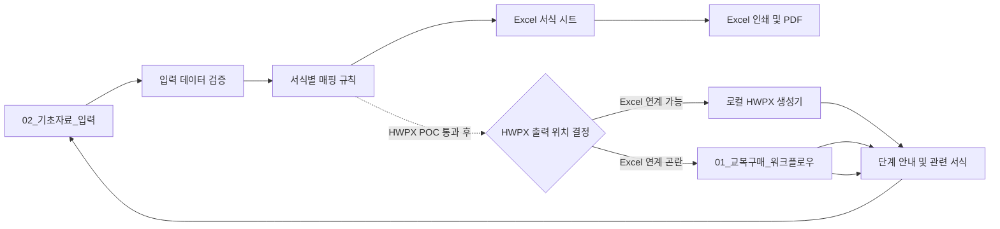

# 계획.md — 교복구매 길라잡이 Excel MVP 및 웹앱 전환

- **상태**: `P2-01 DONE(기술 검증 범위) · P3-01 IN_PROGRESS — F-001~F-006·F-007·F-014~F-025·F-041~F-043 Excel/PDF 구현·검증 완료(22종), 기준 XLSM 수준의 기능 확장 진행 중`
- **작성일**: 2026-09-15
- **우선순위**: Excel/PDF MVP → HWPX 자동화 검증 → 현장 검증 → 웹앱
- **원본 보존 원칙**: 제공된 `.hwpx`·`.xlsm` 원본은 읽기 전용으로 취급하고, 모든 분석·변환·생성은 사본과 별도 산출물에서 수행함.

> **핵심 결론:** Excel의 단일 기초자료 입력과 선택 출력은 바로 설계할 수 있으나, **Excel에서 HWPX를 자동 생성하는 방식은 아직 결정·검증되지 않았음.** 이 경계를 확정하지 않은 상태에서 서식 57종 전체를 구현하면 재작업 위험이 큼.

---

## 1. 목표 및 범위

### 1.1 최종 목표

학교 교사와 행정실 직원이 교복 학교주관구매의 업무단계를 따라가며, 공통 기초자료를 한 번 입력하고 필요한 공문·계약서·평가표·가정통신문·설문지·검수서식을 선택하여 Excel, PDF 및 검증된 범위의 HWPX로 출력할 수 있는 도구를 구축함.

### 1.2 단계별 제공 범위

| 단계 | 제공물 | 범위 |
|---|---|---|
| 1단계 | Excel MVP | 워크플로우, 기초자료 입력, 확정 인벤토리의 전체 서식(사용자 목표 57종), Excel 인쇄/PDF |
| 2단계 | HWPX POC | 대표 3종 템플릿화 및 값 치환·재열기·레이아웃 검증 |
| 3단계 | Excel/HWPX 확대 | Excel 출력은 순차 확장하고, Excel에서 HWPX 출력이 어려우면 승인된 HWPX 생성 기능을 웹앱으로 이관 |
| 4단계 | 웹앱 MVP | 절차 안내, 입력, 문서 생성·다운로드; Excel HWPX 출력 난항 시 HWPX 출력의 대체 구현 경로 |

### 1.3 MVP에서 제외하는 항목

- 학생별 이름·치수·주문·설문 원자료의 저장 및 통합 관리
- 직인·서명 이미지의 자동 삽입 및 보관
- 계약 문구·법령·금액기준을 근거 없이 자동 판정하거나 임의 변경하는 기능
- 기존 XLSM의 외부 연결, 깨진 이름 정의, 매크로를 그대로 복사하는 방식
- HWPX 생성 방식이 검증되기 전의 웹 브라우저 내 HWPX 생성 약속

---

## 2. 검토 결과와 반영 사항

### 2.1 확인한 사실

| 대상 | 확인 결과 | 계획 반영 |
|---|---|---|
| 교복 매뉴얼 HWPX | Kordoc `validate` 구조 검증 통과, 섹션 XML 1개, `BinData` 항목 46개 | 서식 경계는 장/섹션 수가 아닌 문단·표·이미지 배치 순서로 판별함 |
| 기존 XLSM | 워크시트 XML 11개, VBA 프로젝트 존재, 외부 링크 항목 2개, 연결 설정 존재 | 기능만 벤치마킹하고 외부 의존성·VBA를 클린룸 방식으로 재구현함 |
| 사전리서치 | 22종 자동인식과 사용자가 언급한 57개가 불일치하며 일부 외부 사례는 미확인 표시됨 | 인벤토리 확정 전에는 서식 수를 일정·완료조건으로 고정하지 않음 |
| HWPX 템플릿 | 원본에 `{{변수명}}` 표식이 있다고 확인되지 않음 | 복사본 3종에서 템플릿화 가능성부터 실증함 |

### 2.2 코드리뷰어 핵심 권고 반영

1. **P0 — 출력 책임 분리**: Excel XLSM은 입력·검증·미리보기·Excel/PDF 출력과 로컬 보조도구 호출을 담당하고, HWPX는 별도 POC에서 확정한 생성기만 담당함.
2. **P0 — 템플릿화 선행**: HWPX 대량 구현 전에 대표 3종에서 변수 표식, 반복 표, 저장·재열기, 한컴 열기, PDF 결과를 검증함.
3. **P0 — 인벤토리 기준 통일**: 서식, 템플릿, 이미지 자산, 이미지 배치, 참고자료를 서로 다른 수치로 관리함.
4. **P1 — 데이터 모델 선행**: 공통값·문서별 값·반복행·계산값·문서 버전과 매핑 규칙을 분리함.
5. **P1 — 골든 테스트 도입**: 정상·누락·최대길이·복수 업체/위원 입력을 기준 데이터로 고정하고, 승인된 Excel/HWPX/PDF 결과와 비교함.
6. **P1 — 보안 경계 설정**: 개인·계약정보·직인은 최소수집, 저장금지 또는 보유목적·기간·마스킹 규칙을 명시한 뒤에만 취급함.

---

## 3. 목표 아키텍처 초안

### 3.3 실행 하네스

| 구분 | 구성 | 적용 역할 |
|---|---|---|
| 실행 모드 | 하이브리드(병렬 분석 + 순차 구현·검증) | 독립 분석은 병렬 수행하고, HWPX POC→XLSM 구현→품질 검증은 선행 산출물을 넘김 |
| 분석 에이전트 | `uniform-workflow-analyst` | 매뉴얼·서식 인벤토리·근거·입력필드 분석 |
| 문서자동화 에이전트 | `document-automation-engineer` | Kordoc POC, HWPX 템플릿화·생성·검증 |
| Excel 에이전트 | `excel-automation-engineer` | XLSM 워크플로우·자동반영·선택출력 구현 |
| 품질 에이전트 | `quality-compliance-reviewer` | 출력·회귀·개인정보·배포 전 독립 검토 |
| 오케스트레이터 | `.claude/skills/uniform-purchase-orchestrator/SKILL.md` | 계획 기반 재개, 산출물 전달, 차단 항목 관리 |
| Goal 운영 스킬 | `.claude/skills/uniform-purchase-goal/SKILL.md` | `/goal` 조건 작성·상태 확인·복구 절차 |

중간 산출물은 `_workspace/00_input`~`04_qa`, 최종 생성 문서는 `artifacts/excel`, `artifacts/hwpx`, `artifacts/pdf`에 보관함.

### 3.1 Excel MVP 워크북 구성

| 시트 | 역할 | 구현 원칙 |
|---|---|---|
| `01_교복구매_워크플로우` | 9단계 흐름, 단계별 체크리스트·서식 이동 | 하이퍼링크 우선, 매크로 버튼은 승인 후 사용 |
| `02_기초자료_입력` | 학교·사업·일정·단가 등 공통 정보 입력 | 입력/자동계산 셀 구분, 유효성 검사 적용 |
| `03_서식선택_출력` | 단계별 서식 선택·필수값 누락·인쇄 대상 확인 | Form ID, 출력 유형, 누락 상태를 표시 |
| `Fxx_서식명` | 원본을 실무 출력 수준으로 재현한 개별 서식 | 공통 필드 Named Range 또는 테이블 참조 |
| `DB`, `Ref_data`, `학교정보`, `서식Metadata` | 코드·드롭다운·매핑·버전 관리 | 일반 사용자 수정 방지, 외부 링크 0개 |
| `Print_sheet` | 선택한 서식의 인쇄 작업 영역 | 대표서식 출력 검증 후 필요 시 구성 |
| `사용설명서` | 설치·입력·출력·오류 대응 | Windows, Microsoft 365, 한컴오피스 및 XLSM 매크로 허용 절차 명시 |

### 3.2 데이터 모델 최소 단위

| 영역 | 핵심 데이터 | 모델링 원칙 |
|---|---|---|
| 기준정보 | 학교, 학년도, 담당자, 결재권자 | 기준값과 문서 발행 시점 값을 분리 |
| 사업 | 품목, 동복/하복, 상한가, 예정수량, 일정 | 표시값·계산값·확정값을 분리 |
| 절차 | 단계, 담당, 마감일, 체크리스트 | 단계 상태와 예외 사유를 기록 가능하게 설계 |
| 계약 | 입찰, 업체, 낙찰, 계약, 납품 | 업체·계약·품목은 반복행 테이블로 처리 |
| 평가·검수 | 위원, 항목, 점수, 검수 항목 | 가변 행 수를 단일 셀 참조로 고정하지 않음 |
| 문서 | Form ID, 원본 버전, 변수, 매핑, 출력 형식 | 원본·생성본·승인기준의 추적성 확보 |

---

## 4. 단계별 실행 계획

상태값: `TODO` / `IN_PROGRESS` / `BLOCKED` / `DONE`

| ID | 단계 | 작업 | 입력자료 | 산출물 | 완료조건(DoD) | 검증방법 | 상태 | 위험요인 |
|---|---|---|---|---|---|---|---|---|
| P0-01 | 준비 | 원본 파일 무결성·사본 작업 폴더 확정 | HWPX, XLSM, 조사자료 | 작업대상 목록 | 원본 5개 이상 읽기 전용 확인, 사본 경로 기록 | 파일 열기·해시 또는 구조검증 | DONE | 원본 덮어쓰기 |
| P0-02 | 준비 | Kordoc 실제 기능 및 제한 확인 | HWPX, Kordoc | `kordoc_기술검증.md` | 파싱·필드탐색·fill dry-run·patch·validate·render 가능 범위 기록 | 샘플 사본으로 명령 결과 확인 | DONE | 명령 인코딩/한글 경로, 원본 서식 손실 |
| P0-03 | 준비 | XLSM 벤치마크 기능·의존성 분류 | XLSM | `엑셀_벤치마크_분석.md` | 시트·이름정의·외부링크·연결·VBA·인쇄 흐름을 재사용/개선/제외로 분류 | Office 또는 OOXML/VBA 정적 분석 | DONE | 외부 통합문서·연결·매크로 경고 전파 |
| P1-01 | 인벤토리 | HWPX 문단·표·이미지 배치 순서 추출 | HWPX 사본 | `_workspace/01_analysis/HWPX_원시구조_목록.md` | 전체 문단·표·이미지 참조를 순서대로 추출 | 원본 페이지와 표본 대조 | DONE | 표·이미지 기반 서식 경계 오인 |
| P1-02 | 인벤토리 | 서식·참고자료·이미지 분리 및 Form ID 부여 | P1-01 | `서식_인벤토리.md` | 각 서식의 단계, 담당, 유형, 원본위치, 표·이미지 여부, 난이도, MVP 여부 기록 | 누락·중복 Form ID 검사, 업무담당자 표본 확인 | DONE | 22/57개 불일치 |
| P1-03 | 모델 | 공통·문서별·반복·계산 필드와 검증 규칙 정의 | P1-02 | `입력데이터_사전.md`, `서식_매핑표.md` | 모든 MVP 서식에 입력 출처·필수여부·형식·매핑 대상 기록 | 필드 누락·중복·개인정보 점검 | DONE | 모든 정보를 공통값으로 오인 |
| P1-04 | 결정 | 전체 서식 범위·HWPX POC 3종·문서 검토 책임 확정 | P1-02, P1-03 | `결정사항.md` | 실제 인벤토리에서 확정한 전체 서식이 57종 목표와 대조되고, POC 3종은 단순공문·반복/계산·복합표 유형을 포괄 | 사용자 확인 및 업무·계약 담당 검토 | DONE | 22종 자동인식과 57종 목표의 차이 |
| P2-01 | HWPX POC | 대표 3종 복사본을 독립 HWPX 템플릿과 Form ID별 고유 토큰으로 템플릿화하고 값 치환 시험 | P1-04 | 독립 템플릿 사본·토큰 명세·`kordoc_기술검증.md`, `P2-01_템플릿화_사전점검.md`, `_workspace/02_hwpx/P2-01/독립템플릿_토큰명세_검증.md` | 원본을 변경하지 않고 Form ID별 템플릿 1개와 생성본 1개를 만들며, `{{F007학교명}}`처럼 서식별 고유 토큰과 반복행 경계를 확정한 뒤 마스킹값으로 치환·저장·재열기 성공. 파일명은 `FormID_회차식별자_문서역할.hwpx`를 사용함 | Kordoc validate, 재파싱, 원본/결과 PDF 비교, 비대상 Form ID 해시 동일성 확인 | BLOCKED | Kordoc CLI fill 오류, 원본 조판 보존·반복표 경계·한컴 수동 확인 |
| P2-02 | HWPX POC | 생성본의 한컴 열기·PDF 비교·사람 검토 | P2-01 | 골든 HWPX/PDF | 결재란·병합표·글꼴·페이지·특수문자 검토 통과 | 한컴 수동 열기, PDF 육안 비교 | BLOCKED | Kordoc 출력과 한컴 조판 차이 |
| P2-03 | 결정 | HWPX 출력 아키텍처 ADR 확정 | P2-01, P2-02 | `ADR-001-HWPX출력방식.md` | Excel 연계 가능 여부를 실증하고, 곤란하면 웹앱 HWPX 생성 경로·보안 경계를 결정. 복합 매뉴얼 전역 치환과 Form ID별 독립 템플릿·문서군 생성의 오염 방지성·추적성을 비교함 | 설치·보안·유지보수·학교망·개인정보·타 서식 오염 방지 기준 비교 | BLOCKED | `.xlsx`와 자동 호출 요구 충돌 |
| P3-01 | Excel MVP | 기준 XLSM의 실제 사용자 흐름을 분석하고 워크플로우·기초자료·참조 UI를 재설계 | P1-03, P1-04, 기준 XLSM 직접 검토 | 기준 기능·화면 분석서, 재설계 XLSM 초안, `P3-01_Excel_MVP_설계검증.md` | 기준 XLSM 수준의 입력 화면, 공통값 자동 반영, 필수값 오류 표시, 선택·출력 제어 설계를 구현 | 기준 파일과 신규 파일을 화면·기능 단위로 직접 비교 | IN_PROGRESS | 기준 XLSM 수준 기능 동등성(X-06) 미달; F-007·F-014~F-024(12종)는 구현·검증(자동 검증+PDF 육안 확인)까지 완료했으나 계약방법안내는 수동 확인형 예시 반영까지만 구현, 40개 서식 미구현(F-013 포함) |
| P3-02 | Excel MVP | 대표 서식 조판·선택 출력 구현 후 전체 확정 서식으로 확장 | P3-01 | 승인된 `.xlsm` | 대표 서식의 표·병합·인쇄 조판과 선택 출력, 이후 52종 공통값 자동반영·개별 선택 인쇄 구현 | 골든 데이터와 Excel/PDF 비교 | BLOCKED | 복합표의 Excel 재현 한계, 57종 범위에 따른 검증량 증가 |
| P3-03 | Excel MVP | 골든 테스트·사용설명서·배포 패키지 작성 | P3-02 | `test.md`, `체크리스트.md`, 사용설명서 | 정상/누락/최대길이/복수행 케이스와 57종 출력 목록 통과 | 회귀·부정·인쇄 테스트 | BLOCKED | 매크로 보안 정책 |
| P4-01 | 현장 검증 | 학교 담당자 시나리오 검증 및 결함 수정 | P3-03 | `로그.md`, 개선판 | 신규 담당자도 5개 대표서식 생성 완료 | 관찰기반 사용성 테스트 | TODO | 실제 업무 절차와 문서 책임 불일치 |
| P5-01 | 웹 설계 | 웹 요구사항·기술·개인정보 ADR 확정 | Excel/HWPX 검증 결과 | `prd.md`, 웹 ADR | Excel HWPX 출력 곤란 시 웹앱 HWPX 생성 경로와 정적 웹·서버리스·DB 도입 기준을 확정하고, 절차 탐색은 정적 콘텐츠·작성 상태는 클라이언트 우선으로 분리 | 비용·접근성·보안·운영성·입력값 비영구 저장 비교 | TODO | 정적 웹의 HWPX 생성 가능성을 추정함 |
| P5-02 | UX/UI | 업무 흐름 중심 Wireframe·디자인 시스템·접근성 검토 | P5-01 | `웹앱_UX설계.md` | 9단계 탐색 허브→단계 상세→관련 Form ID→입력·누락 검사→미리보기·다운로드 흐름과 현재 단계·이전/다음 이동을 정의함 | 키보드·본문 바로가기·명도·입력칸 인접 오류·모바일·처음 사용자 시나리오 점검 | TODO | 관리형 SaaS 화면으로 과도하게 복잡해짐 |
| P5-03 | 웹 MVP | 검증된 데이터 모델 및 출력 방식으로 구현·배포 | P5-01, P5-02 | 웹앱·운영문서 | 업무 흐름→입력→검증→PDF 다운로드 및 Excel 대체 HWPX 다운로드 시나리오 통과 | 자동검사·수동 시나리오·배포 검증 | TODO | 개인정보 서버 전송·문서 생성 장애 |

---

## 5. 품질 및 보안 게이트

### 5.1 통과 기준

- 새 Excel 파일은 외부 링크·외부 연결·`#REF!` 이름 정의가 각각 0건임.
- 각 대표서식은 공통 필드 누락 없이 반영되고, 문서별 전용 필드는 다른 서식을 오염시키지 않음.
- 필수값 누락, 날짜 역전, 수량·단가 불일치, 위원 중복, 빈 반복행을 차단하거나 명확히 표시함.
- Excel PDF와 HWPX PDF는 별도 기준본으로 관리하고, 결재란·병합표·체크박스·페이지 잘림을 확인함.
- HWPX는 `validate` 통과만으로 완료 처리하지 않으며, 한컴 열기 및 업무담당자 검토를 함께 통과해야 함.
- 배포 전 공문·계약 문구와 서식 구조는 행정실 직원이 최종 확인함. 배포본에는 자동 생성 결과의 사실관계·계약조건·결재사항을 확인한 뒤 출력한다는 안내를 표시함.

### 5.2 개인정보 및 보안 원칙

| 데이터 구분 | MVP 처리 원칙 |
|---|---|
| 학생·학부모 개인식별·치수·설문 원자료 | 수집·저장·웹 전송 제외 |
| 교직원·평가위원·업체 연락처 | 필요한 모든 정보를 문서 출력에 반영하되, 별도 중앙 저장·출력이력 저장 없이 해당 XLSM 작업본에서만 처리함 |
| 계좌·사업자·계약 정보 | 문서 출력에 필요한 값을 반영하되, 로그·채팅·버전관리 저장소에 노출하지 않음 |
| 직인·서명 | 자동 처리 제외; 별도 보관·권한·승인 체계 마련 전까지 수동 처리 |
| Excel 매크로 | 필요성·신뢰 위치·디지털 서명·악성 매크로 대응 안내를 확정한 경우에만 사용 |

---

## 6. 최초 요구사항 확정 결과

다음 확정사항을 기준으로 인벤토리와 기술검증을 진행한 뒤 `prd.md`, `task.md`, `로드맵.md`, `test.md`, `체크리스트.md`, `로그.md`를 생성·갱신함. 단, XLSM 파일을 저장하면 입력값이 파일에 남을 수 있으므로 출력 후 `입력값 초기화` 기능과 사용 절차를 제공함. 별도 서버·중앙 저장소·출력이력은 MVP에 두지 않음.

| 결정 ID | 결정할 내용 | 기본 권고안 | 상태 |
|---|---|---|---|
| D1 | 1차 MVP 서식 범위 | 실제 인벤토리로 확정되는 전체 서식; 사용자 목표 57종 모두 포함 | CONFIRMED |
| D2 | Excel 배포 형식 | `.xlsm` 허용 | CONFIRMED |
| D3 | HWPX 출력 실행 방식 | 대표 3종 POC 후 학교 PC의 로컬 보조도구를 우선 적용 | CONFIRMED |
| D4 | 대상 PC 환경 | Windows + Microsoft 365 + 한컴오피스 설치 환경 | CONFIRMED |
| D5 | 데이터 범위·처리 방식 | 문서 출력에 필요한 정보는 모두 반영, 중앙 저장 없이 휘발성 운영; 학생·학부모 정보 및 직인 자동처리는 제외 유지 | CONFIRMED |
| D6 | 공문·계약서 최종 검토 책임 | 행정실 직원이 자동 생성 결과의 사실관계·계약조건·서식 상태를 최종 확인 | CONFIRMED |

---

## 7. 변경 이력

| 일자 | 변경 | 근거 |
|---|---|---|
| 2026-09-15 | 초안 작성 | 사용자 최초 요구, 사전리서치, PM-Agent 프롬프트, 기존 계획 초안, 코드리뷰어 검토, HWPX/XLSM 읽기 전용 구조 확인 |
| 2026-09-15 | HWPX 자동출력 선결 조건과 XLSM 클린룸 원칙 추가 | 코드리뷰: 템플릿 표식·호출 방식 미확정, XLSM 외부 연결 존재 |
| 2026-09-15 | 1차 범위를 전체 서식(57종 목표), XLSM 사용, 로컬 HWPX 보조도구, Windows/Microsoft 365/한컴 환경으로 확정 | 요구사항 확정 인터뷰 답변 |
| 2026-09-15 | 자동 생성 공문·계약서의 최종 확인 책임자를 행정실 직원으로 확정 | 요구사항 확정 인터뷰 답변 |
| 2026-09-15 | Harness 플러그인과 교복구매 전용 4개 에이전트·2개 스킬·중간/최종 산출물 디렉터리 구성 | 하네스 구성 요청 및 Claude Code Goal 공식 문서 확인 |
| 2026-09-15 | Excel HWPX 출력이 기술·운영상 곤란할 경우, HWPX 기능을 웹앱 출력 경로로 이관하는 대체 경로 추가 | 사용자 결정 |
| 2026-09-16 | 계약방법안내 시트에 2단계 입찰 예시의 수동 확인·명시 반영 경로와 사본 자동검사를 추가 | Excel v1 안전 빌드·사본 검증 PASS |
| 2026-09-16 | 위원·평가점수 반복행과 무암호 저장 전 DB 재검증을 추가 | `DB_위원`·`DB_평가` 정규화 저장 및 사본 검증 PASS, 사용자 선택에 따라 무암호 보호는 우발적 편집 방지로 한정 |
| 2026-09-17 | F-017 제출서류 자기확인서를 업체별 PDF 출력으로 추가 | 업체명만 반영하고 대표자·연락처·대리인 정보는 빈 양식으로 유지, A4 1쪽·PDF·임시 시트 정리·빈 업체명 `0` 미표시 검증 PASS |
| 2026-09-17 | F-018 정량적 평가 자기 평점표를 업체별 PDF 출력으로 추가 | 학교 F-015 점수와 분리한 `N:Q` 자기평점·`DB_자기평점` 저장, 저장·수정·불러오기·저장경계·A4 1쪽·PDF·임시 시트 정리·빈 양식 공란 검증 PASS |
| 2026-09-17 | F-019 입찰참가신청서를 업체별 PDF 출력으로 재개·완료 | 업체명·학교 공통정보만 반영, 법인·주소·전화·주민번호·대리인·인감 빈칸 유지, A4 1쪽 결함 발견·수정, PDF 육안 확인 포함 검증 PASS |
| 2026-09-17 | F-020 입찰 참가 신고서를 업체별 PDF 출력으로 추가 | 업체명·학교 공통정보만 반영, 사업자 번호·대표자·인감 빈칸 유지, 자동 검증 PASS(별도 PDF 육안 확인은 미실시, 다음 세션 보완 과제) |
| 2026-09-18 | F-020 PDF 육안 확인 완료 | COM `ExportAsFixedFormat`의 `From`/`To` 인자 처리 오류를 수정해 비식별 사본에서 PDF를 정상 생성·렌더링, A4 1쪽·잘림 없음·개인정보 공란 유지를 직접 확인 |
| 2026-09-18 | F-021 교복 납품 제안서를 업체별 PDF 출력으로 추가, F-022 빌드 결함 수정 | 업체명·학교 공통정보만 반영, 대표자·주소·연락처·연혁·서명 등은 빈 양식 유지, 자동 검증(146/146 PASS)+PDF 육안 확인 완료. 안전 빌드 파이프라인을 막던 F-022(부분 작성 상태) 섹션의 타입 캐스팅 오류·A4 1쪽 초과를 최소 수정(F-022 자체는 미완료로 유지) |
| 2026-09-18 | F-022 교복 납품 실적표를 업체별 PDF 출력으로 완료 | 원본 HWPX `[9-10]` 대조로 실적행 9행 누락(기존 8행)을 발견·수정, 업체명·학교 공통정보만 반영하고 실적행 6열은 수기 작성 공란 유지, 자동 검증(146/146 PASS)+PDF 육안 확인 완료. 훅 검증 스크립트와의 잠금 경합(사전 경고된 이슈)을 재현·회피함 |
| 2026-09-18 | F-023 교복 제조 사양서를 업체별 PDF 출력으로 완료 | 원본 HWPX `[9-11]` 대조로 가격표가 아닌 업체명 전용 서식임을 확인(서식_매핑표.md의 R-04~R-06/K-01 매핑은 F-013 행과 동일한 복사 오류로 판단, 별도 기록·미수정), F-017~F-022 패턴에 따라 업체명·학교 공통정보만 반영하고 재질·설명 내용·서명란은 수기 작성 공란 유지, 자동 검증(151/151 PASS)+PDF 육안 확인 완료. 훅 검증 스크립트와의 잠금 경합을 프로세스 종료 대기로 회피함 |
| 2026-09-18 | F-025 교복 A/S 계획서 구현 착수 후 사용자 요청으로 세션 중단 | 원본 HWPX `[9-14]` 대조 결과 업체명 표시 자리가 없는 순수 텍스트 서식임을 확인, 시트·VBA·검증 스크립트 코드는 작성했으나(구문 검사 통과) 안전 빌드 실행·PASS 확인·PDF 육안 확인 전에 중단되어 미검증 상태로 남김. `서식_매핑표.md`의 F-025·F-026 행이 동일 문구인 것도 발견해 기록만 함 |
| 2026-09-18 | F-025 교복 A/S 계획서 안전 빌드·PDF 육안 확인 완료(재개 세션) | 좀비 EXCEL.EXE(PID 26012) 정리 후 안전 빌드 전체 단독 실행으로 전 항목 PASS(`artifacts/excel/교복구매_길라잡이_20260918_v1.xlsm`), 비식별 사본 PDF 200dpi 렌더링으로 업체명 미출력·학교 공통정보만 반영·A/S 기간·편의성·지정업체·내용 전 항목 공란·A4 1쪽 잘림 없음을 직접 확인함. 이로써 Excel 구현 완료 Form ID 13종(F-007·F-014~F-025) 확정 |
| 2026-09-18 | F-025 검증 로그 재생성(훅 레이스 재발) | 문서 갱신 Edit들이 트리거한 훅 백그라운드 재검증 실패로 `verify_v1_log.txt`가 삭제됨(F-023 때와 동일 현상). 충돌 프로세스 없음을 재확인 후 안전 빌드를 한 번 더 단독 실행해 `교복구매_길라잡이_20260918_v2.xlsm`(FAIL 0건 클린 로그)으로 배포 후보를 재확정함(코드 변경 없음) |
| 2026-09-18 | 남은 38개 Form ID의 우선순위를 5개 그룹 + 구조적 공백(F-001~006)으로 정리(8.1절 신설) | 비용 최소(1순위)→새 데이터 소스(2순위)→독립적/쉬움(3순위)→개인정보 특별 취급(4순위)→고난도 조판(5순위) 순서로 구현 비용·업무 흐름·개인정보 경계를 기준 판단함. 사용자가 전체 목록을 직접 검토해 생략·후순위 항목을 최종 확정할 예정이라 이 순서는 잠정안임 |
| 2026-09-18 | 8.1절 잠정안을 사용자 최종 결정으로 확정(범위 제외 9종·후순위 4종·작업 순서 0~6단계) | 사용자가 전체 Form ID 목록을 직접 검토해 F-026·F-028·F-051·F-052·F-053~F-057을 범위 제외로, F-027·F-029·F-030·F-031을 후순위로 지정하고, 나머지 31종+F-025는 인프라 재사용성·난이도 순으로 배치하도록 지시함 |
| 2026-09-19 | 8.1절 1순위(F-001~F-006) 전체 완료 | 구조적 공백 6종을 위원 반복행 기존 저장소 재사용으로 구현, 6종 전부 안전 빌드 PASS·PDF 육안 확인 완료(`_workspace/03_excel/F-001_구현검증.md`~`F-006_구현검증.md`) |
| 2026-09-19 | P2-01(HWPX POC) 기술 검증 범위 `DONE`으로 전환 | F-007·F-024·F-013 3종 모두 라벨 기반(`kordoc generate`) 방식으로 `fill→validate→render→재파싱` 왕복 검증 통과. F-013은 이미지 임베드 결함(41개 중 17개 더미 픽셀)을 발견·정정·최종 해결까지 정직하게 기록(원인은 kordoc 결함이 아니라 세션 자신의 재추출 폴더 오염이었음, 독립 재검증으로 41/41 바이트·해시 일치 재확인). P2-02(한컴 수동 검토)는 사람 몫으로 별도 남음 |
| 2026-09-19 | 8.1절 2순위(F-041~F-043) 전체 완료 | "낙찰 업체 1곳 선택" 패턴(F-015 I3 선택 순번 재사용)으로 3종 구현, 안전 빌드 PASS·PDF 육안 확인 완료(`_workspace/03_excel/F-041_043_구현검증.md`). F-043만 원문 명시적 산식으로 계약금액 자동 계산 구현 |
| 2026-09-19 | HWPX 값 치환 방식 재검토 — kordoc 라벨 매칭 대신 `{{토큰}}` + 직접 XML 조작 방식 검증 착수 후 사용자 지시로 중단 | 사용자가 실제 운영 파이프라인(기초자료 입력→서식 자동 반영→HWPX 출력)에 더 가까운 명시적 토큰 방식을 요구함. `new-hwpx-master-v5-1-20260720` 스킬의 XML 직접 조작 기법(1~8단계)을 재사용 후보로 확인했으나, F-007 검증 착수 직후 사용자가 "중단하고 문서 업데이트" 지시로 세션을 정지시켜 결과 미확정 상태로 남음. 재개 시 이어서 진행할 것 |
| 2026-09-19 | `{{교장명}}` HWPX 토큰 허용 범위 재확정 | 코드리뷰·품질검토(`_workspace/04_qa/P3-01_코드리뷰.md`, `P3-01_품질준수검토.md`)가 `{{교장명}}`을 개인식별정보 경계상 거부했으나, 사용자가 "기초자료를 각 서식에 자동반영해 업무에 사용하려는 것이며 개인정보보호 문제로 업무상 문제되지 않는다"고 명시적으로 확인함. 결재권자(교장)의 직무상 성명은 공문서 관행상 통상 기재되는 정보로 판단해 허용 목록에 포함함(`입력데이터_사전.md` C-07, `scripts/hwpx_token_fill.ps1`의 `$AllowedTokens`/`$ForbiddenTokenPattern` 갱신). 위원 성명(청탁방지·익명성 원칙)·업체 대표자명 등 그 외 개인 실명과 연락처·서명·직인은 이 결정과 무관하게 계속 배제함 |
| 2026-09-19 | 8.1절 3순위(F-032~F-040, 평가그룹 9종) 전체 완료 | 착수 전 (a)(b) 그룹이 최신 코드 기준 안전 빌드를 통과한 적 없는 상태(VBA 컴파일 크기 한계 초과로 저장 실패)임을 발견해 `선택된시트목록` 프로시저를 먼저 리팩터링함. (c) F-035·036·039를 신규 구현(F-039는 F-041~043과 같은 I3 단일 선택 패턴 재사용). PDF 육안 확인 중 F-039 제목 병합 버그·F-035 0점 오표시·F-032/039 A4 폭 초과·PowerShell `"$변수:"` 콜론 오인식 결함(F-040·F-033)을 발견·수정함. 이 콜론 오인식 패턴이 범위 밖 서식(F-007·F-014 등)에도 존재함을 확인했으나 수정하지 않고 기록만 함(후속 검사 필요). 안전 빌드 256/256 PASS, PDF 육안 확인 완료(`_workspace/03_excel/F-032_040_구현검증.md`) |

---

## 8. 다음 작업

1. **남은 Form ID는 아래 8.1절 확정 순서(2026-09-18 사용자 최종 결정)로 진행함.** F-025는 2026-09-18 완료됨(아래 8.1절 순위표에서 제거). F-026·F-028·F-051·F-052·F-053~F-057(9종)은 범위에서 제외하고, F-027·F-029·F-030·F-031(4종)은 아래 순서 1~6 완료 후 후순위로 진행함.
2. **HWPX 명시 토큰 경로를 우선 검증함(2026-09-19 방향 보강, 같은 날 허용 범위 재확정).** 기존 Kordoc 라벨 기반 POC는 기술 검증을 마쳤으나, 운영 경로는 Form ID별 독립 사본에 `{{학교명}}`·`{{학년도}}`·`{{문서번호}}`·`{{교장명}}` 등 허용 토큰을 두고 기초자료 값을 치환하는 방식으로 보강함. `{{교장명}}`은 결재권자의 직무상 성명으로 공문서 관행상 통상 기재되는 정보이므로 허용 목록에 포함하며(사용자 결정, `입력데이터_사전.md` C-07), 위원 성명·업체 대표자명 등 그 외 개인 실명과 연락처·서명·직인은 계속 토큰화·자동 반영하지 않는다. XML 런 분절에도 안전한 치환, 원본 스타일·구조 보존, ZIP/XML 유효성, 토큰 잔존 0, 재열기와 한컴/PDF 조판 확인을 각각 검증한다.
3. **Excel 입력→서식 자동반영·선택 이동/출력·A4/PDF를 P3-01 완료 기준으로 유지함.** 구현 서식은 기초자료 셀을 직접 참조해 자동 반영하고, 서식선택에서 Form ID 이동·선택 인쇄 미리보기·PDF 저장을 제공한다. 조판은 각 원본 HWPX의 실제 페이지 구성에 맞춰 Form ID별로 A4 자연 배율·인쇄영역·페이지 나눔을 검증하며, 모든 서식을 1쪽으로 강제 축소하지 않는다. F-001~F-006·F-007·F-014~F-025·F-041~F-043(22종)은 구현·PDF 육안 확인까지 완료했다. 남은 Form ID와 계약방법 전체 안내/판단 흐름을 완료해 X-06을 통과한다.
4. HWPX 명시 토큰 경로가 구조·재열기·한컴/PDF 검증을 통과하면 Excel과의 JSON/명령 계약을 확정한다. 이 경로가 실증 실패하거나 학교망 운영·보안 조건을 충족하지 못할 때만 P2-03 ADR에서 웹 HWPX 생성으로 이관하며, 그때 P5-01의 전송·삭제·장애 처리 경계를 먼저 확정한다.
5. P5 구현 시 절차 탐색 허브→단계 상세→관련 Form ID→입력·누락 검사→미리보기·다운로드 UX와 W-01~W-05를 적용함.

### 8.1 남은 Form ID 작업 계획(2026-09-18 사용자 최종 확정)

사용자가 전체 목록을 직접 검토해 범위 제외·후순위·작업 순서를 확정함. 이전 "잠정안"은 이 절로 대체함.

**범위 제외(9종, 구현하지 않음)**: F-026(소비자 불만 처리 계획), F-028(서약서), F-051(만족도 설문조사 결과), F-052(만족도 조사 설문 결과 서식), F-053~F-057(참고자료 5종 — 섬유 종류·특징, 품질기준, Q마크, 계약특수조건 고려사항). `서식_인벤토리.md`·`서식_매핑표.md`·`서식선택_출력` 시트의 해당 행은 후속 작업에서 "제외"로 표시함.

**후순위 보류(4종, 아래 1~6 순위 완료 후 진행)**: F-027(위임장), F-029(개인정보제공 동의서), F-030(청렴계약 이행서약서), F-031(교복 품목별 금액표)

**완료(0순위, 2026-09-18)**: F-025(교복 A/S 계획서) — 안전 빌드 PASS·PDF 육안 확인까지 완료함(`_workspace/03_excel/F-025_구현검증.md`). 아래 순위표에서 제거함.

**작업 순서(나머지 31종)**:

| 순위 | Form ID | 근거 |
|---|---|---|
| 1(구조적 공백) — **완료(2026-09-19)** | F-001~F-006(6종) | 업무 흐름 최전단("준비")인데 0/6 구현이었음. 위원 반복행은 신규 설계 대신 F-014~016용으로 마련됐으나 미사용이던 기존 저장소(`기초자료입력!B58:C67`, `DB_위원`)를 재사용해 F-001·F-005·F-006 3종이 공유함. 6종 전부 안전 빌드 PASS·PDF 육안 확인 완료(`_workspace/03_excel/F-001_구현검증.md`~`F-006_구현검증.md`, 아래 "F-001~F-006 작업 완료 기록" 참고) |
| 2(저비용, 기존 패턴 재사용) — **완료(2026-09-19)** | F-041~F-043(3종) | 낙찰자결정·통보·계약체결. "낙찰 업체 1곳 선택" 패턴(F-015의 I3 선택 순번 재사용)으로 구현. 3종 전부 안전 빌드 PASS·PDF 육안 확인 완료(`_workspace/03_excel/F-041_043_구현검증.md`, 아래 "F-041~F-043 작업 완료 기록" 참고) |
| 3(같은 인프라, 신규 데이터 연동) — **완료(2026-09-19)** | F-032~F-040(9종) | 평가 그룹. 세부 순서: (a) F-037·F-038·F-040(등록부·서약서 — 위원/업체 DB 재사용, 가장 쉬움) → (b) F-032·F-033·F-034(접수·개최 기안문) → (c) F-035·F-036·F-039(평가결과 집계 — 계산 필드 포함, 이 그룹에서 가장 어려움). 상세: `_workspace/03_excel/F-032_040_구현검증.md` |
| 4(독립적, 낮은 난이도) | F-044~F-046·F-048(4종, L) → F-047(1종, H) | 구매단계 가정통신문. F-044~046·048은 공통값 중심으로 먼저 처리하고, F-047(수요조사)은 개인정보 보안검토가 추가로 필요해 같은 그룹 내 마지막에 배치함 |
| 5(개인정보 특별 취급) | F-049~F-050(2종) | 만족도조사 실시(L)·설문지(H). F-050은 개인정보 가능 문서로 매 항목 `quality-compliance-reviewer` 별도 검토 필요 |
| 6(고난도 조판, 가장 나중) | F-008~F-013(6종) | 계약 담당, 난이도 H. 세부 순서: (a) F-009·F-010(단순 기안문형) → (b) F-011·F-012(표 중심) → (c) F-008·F-013(표·이미지 복합, F-013은 HWPX 위임 검토 대상 유지) |
| 후순위 보류 | F-027·F-029·F-030·F-031 | 위 0~6 순위 완료 후 진행(사용자 지정) |

원본: 이전 잠정안은 `서식_인벤토리.md` 3절(담당·난이도표)을 근거로 코디네이터가 도출했고, 이번 절은 사용자가 그 잠정안을 검토해 제외·후순위·순서를 확정한 결과임.

## F-019 작업 완료 기록

F-019 입찰참가신청서는 2026-09-17 세션에서 재개해 완료함. 업체명·학교 공통정보만 반영하고 법인등록번호·주소·전화번호·주민등록번호·대리인·사용인감은 빈칸으로 유지함. 안전 빌드·자동 검증·PDF 수동 QA를 모두 통과했으며(`artifacts/excel/교복구매_길라잡이_20260917_v8.xlsm`), 상세는 `_workspace/03_excel/F-019_구현검증.md`를 따름.

## F-001~F-006 작업 완료 기록 (계획.md 8.1절 1순위)

2026-09-18~19 세션에서 8.1절 1순위(F-001~F-006, "구조적 공백") 6종 전체를 Form ID 하나씩 원문 대조→시트/VBA 구현→안전 빌드→PDF 육안 확인 순서로 완료함.

- **F-001(위원회 구성 기안)**: F-007 기안문 틀에 위원 명단 표 추가. 위원 성명은 F-014~016 설계 시 마련됐으나 미사용이던 `기초자료입력!B58:C67`("위원 반복행")을 재사용해 마스킹 식별표시만 반영. 검증 162/162 PASS.
- **F-002(위원 수락 및 확인서)**: 표 없는 순수 서약 문서, 주소·성명·서명 전부 공란. PDF 확인 중 다중행 병합 셀 텍스트 잘림·병합 자동 통합 2가지 Excel COM 결함을 발견·수정. 검증 166/166 PASS.
- **F-003(위원 청렴 및 보안 서약서)**: PowerShell `@()` 배열 리터럴의 첫 원소가 문자열 연결(+)식이면 `[scriptblock]::Create()` 실행 경로에서 배열이 원소 1개로 붕괴하는 파서 결함을 발견·해결(이 프로젝트 전체에 영향을 줄 수 있는 중요한 발견). 검증 173/173 PASS.
- **F-004(구매 추진 계획 수립 기안문)**: 위원 명단 표 없는 단순 2단락 기안문. 줄바꿈 문단 잘림 결함(F-002와 동일 계열) 발견·수정. 검증 176/176 PASS.
- **F-005(구매 추진 계획안)**: 원문이 6개 물리 페이지 분량임을 확인해 "A4 1쪽 자연 배율" 원칙의 명시적 예외(3쪽 자연 다중 페이지 출력)로 구현. `.Formula`/`.Value2` 혼용, `Rows.AutoFit()`의 병합 셀 줄바꿈 계산 한계, 한글 곡선 따옴표 파싱 결함 3가지를 발견·수정. 검증 182/182 PASS.
- **F-006(학교운영위원회 심의(안))**: F-001의 위원 반복행·F-007의 상한가격 수식을 그대로 재사용. F-001~F-005에서 확립한 COM/파서 함정 회피 원칙을 처음부터 적용해 첫 안전 빌드부터 즉시 189/189 PASS, PDF 확인도 1회만에 정상 확인.

6종 모두 위원 성명은 마스킹 식별표시만 반영하고 실명을 자동 처리하지 않음. 상세는 각각 `_workspace/03_excel/F-00N_구현검증.md`를 따름. 다음 순위는 8.1절 2순위(F-041~F-043).

## F-025 작업 완료 기록

F-025 교복 A/S 계획서는 2026-09-18 직전 세션에서 시트·VBA·검증 스크립트 코드 작성까지 마치고 사용자 요청으로 중단된 뒤, 같은 날 재개 세션에서 완료함. 원본 HWPX `[9-14]` 대조 결과 표가 아닌 순수 텍스트 서식(1. A/S 기간, 2. A/S 편의성, 3. A/S지정업체, 4. A/S 내용)이며 F-021~F-023과 달리 업체명 표시 자리 자체가 원문에 없음을 확인하고, 학교 공통정보(날짜·수신처)만 반영하고 나머지 전 항목은 업체가 직접 작성하는 공란으로 유지함. 좀비 EXCEL.EXE(PID 26012)를 정리한 뒤 안전 빌드 전체를 단독 실행해 전 항목 PASS를 확인하고(`artifacts/excel/교복구매_길라잡이_20260918_v1.xlsm`), 비식별 사본의 PDF를 200dpi로 렌더링해 업체명 미출력·A4 1쪽 잘림 없음을 직접 육안 확인함. 이후 문서 갱신 Edit들이 트리거한 훅 재검증이 실패해 `verify_v1_log.txt`가 삭제됨(F-023 때와 동일 현상). 재확인 후 안전 빌드를 한 번 더 단독 실행해 `교복구매_길라잡이_20260918_v2.xlsm`(FAIL 0건 클린 로그)으로 배포 후보를 재확정함. 상세는 `_workspace/03_excel/F-025_구현검증.md`를 따름.

## F-041~F-043 작업 완료 기록 (계획.md 8.1절 2순위)

2026-09-19 세션에서 8.1절 2순위(F-041~F-043, "저비용·기존 패턴 재사용") 3종 전체를 완료함. 원본 HWPX 68~73쪽(`[14]`~`[16]`)을 대조한 결과 F-017~F-025의 "업체 반복행 전체 순회" 패턴과 달리 낙찰자·계약상대자는 항상 1개 업체뿐이므로, F-015가 이미 쓰던 "I3 선택 순번 → `INDEX(기초자료입력!$B$44:$B$53, I3)`" 단일 선택 패턴을 재사용해 F-001/F-006과 같은 단일 출력 구조로 구현함.

- **F-041(낙찰자 결정)**: 낙찰 업체명(R-03)만 반영, 대표자·비고(주소) 공란. `서식_매핑표.md`의 K-02(합계금액) 매핑이 원문에 없는 반복 품목·합계 구조를 가리키는 불일치를 발견(기록만, 미수정).
- **F-042(낙찰자 결정 통보)**: 수신·낙찰자 표 업체명 반영, 기존 `기초자료입력!C18`(B-07 제출기한, 이전까지 어떤 서식도 소비하지 않던 필드) 재사용. PDF 육안 확인에서 "계약체결금액(원)" 표 헤더가 열 폭을 넘어 겹치는 결함을 발견·수정.
- **F-043(계약체결)**: 계약상대자 업체명만 반영, 소재지·대표자·전화번호 공란. 원문의 명시적 산식("단가×예정수량")에 따라 K-01/K-02를 유일하게 실제 구현(신규 단가 입력영역×기존 `기초자료입력!C16` 예정수량).

3종 모두 안전 빌드 2회(1차 `교복구매_길라잡이_20260919_v3.xlsm` 216/216 PASS → PDF 확인 중 F-042 결함 발견·수정 → 2차 `교복구매_길라잡이_20260919_v4.xlsm` 216/216 PASS, 기존 F-001~F-025·DB 회귀 없음)와 비식별 사본 PDF 육안 확인(3종 결합 3쪽, A4 1쪽 잘림 없음, 개인정보 필드 공란, F-043 계약금액 자동 계산 정확)을 통과함. 상세는 `_workspace/03_excel/F-041_043_구현검증.md`를 따름. 다음 순위는 8.1절 3순위(F-032~F-040, 평가그룹 9종).

## F-032~F-040 작업 완료 기록 (계획.md 8.1절 3순위)

2026-09-19 별도 세션에서 8.1절 3순위(F-032~F-040, 평가그룹 9종)를 지정 순서(a→b→c)대로 완료함.

**착수 전 발견한 차단 요인**: (a) F-037·038·040, (b) F-032·033·034 그룹은 이전 세션에서 시트·VBA 코드가 이미 작성돼 있었으나, 실제로는 최신 코드 기준 안전 빌드·검증이 한 번도 끝까지 통과한 적이 없었음. `verify_v1_log.txt`가 F-032~034 시트 생성 이전 실행(FAIL) 기록이었고, 그 사이 `build_excel_v1_vba.ps1`이 계속 수정되며 `선택된시트목록` 프로시저가 Form ID 누적으로 VBA "프로시저가 너무 큼" 컴파일 한계를 실제로 초과해 `$wb.Save()`가 3회 재시도 모두 실패하는 회귀가 있었음. 30개 개별 skip 카운터 변수 → Dictionary 하나, 단순 출력군 20개 Form ID의 ElseIf 문자열 비교 → Select Case 조회 함수로 리팩터링해 해소함(업체 반복 출력군 로직은 동작 변경 없음).

**(c) 신규 구현**: F-035(정량평가 결과)·F-036(제안서 평가 결과)은 F-032/033처럼 업체 반복행 10행 집계 보고서로 F-015/F-016 학교 평가 입력열을 재조회함(신규 DB 없음). F-039(업체별 제안서 평가표)는 F-041~043과 같은 I3 단일 업체 선택 패턴을 재사용하고, 위원 8명 원점수 입력칸(문서 전용, `E8:H15`)과 "최고점·최저점 제외" 총계/평균 수식을 신규 구현함(위원명은 청탁방지·익명성 원칙에 따라 자동 반영 금지, 자필 공란).

**PDF 육안 확인 중 추가로 발견·수정한 결함**:
- F-039 제목 병합(`B3:J4`)이 선택 순번 셀 `I3`를 삼켜 값 설정이 무시되던 버그 → 병합 범위를 `B3:H4`로 축소.
- F-035 D~G열이 소스 점수 셀의 공백 여부를 확인하지 않아 점수 미입력 업체가 0점 합계로 표시되던 버그 → 소스 셀 공백을 직접 확인하도록 수정.
- F-032·F-039의 A4 1쪽 폭 초과 → F-032는 열 폭·여백 축소, F-039는 세로→가로 방향 전환.
- **PowerShell 문자열 보간의 구조적 함정**: `"$변수:"`(변수 바로 뒤 콜론)를 PowerShell이 드라이브/스코프 한정자 구문으로 오인해 콜론 이하가 통째로 사라지는 결함을 F-040(4개 준수사항 병합 전부 실패로 문단이 잘림)과 F-033(하이라이트 범위 절반만 적용)에서 재현·확정하고 `${r}` 명시로 회피함. **이 패턴이 F-007·F-014 등 이번 범위 밖의 기존 "완료" 서식에도 동일하게 존재함을 확인했으나, 범위 밖이라 이번 세션에서는 수정하지 않고 기록만 함 — 후속 세션에서 전수 검사·PDF 재확인 권고.**

9종 모두 최종 안전 빌드 256/256 PASS, FAIL 0건(`교복구매_길라잡이_20260919_v10.xlsm`)과 비식별 사본 PDF 육안 확인(F-032~040 9종 결합 + F-033·F-040 재검증)을 통과함. 상세는 `_workspace/03_excel/F-032_040_구현검증.md`를 따름. 다음 순위는 8.1절 4순위 이후(F-008~013·F-026~031·F-044~052 등)이며, 위에서 발견한 범위 밖 결함(F-007·F-014 등)도 후속 확인이 필요함.
