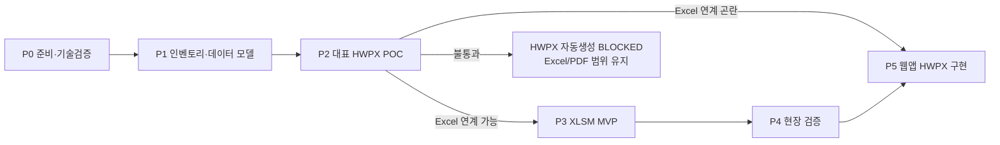

# 로드맵 — 교복구매 길라잡이

## 단계 게이트

| Phase | 목표 | 진입 기준 | 종료 기준 | 현재 상태 |
|---|---|---|---|---|
| P0 | 원본 보존, 기술·의존성 한계 확정 | 원본 접근 가능 | P0-02·P0-03 근거 문서와 자동 검사 통과 | DONE |
| P1 | 실제 서식 수와 데이터 모델 확정 | P0 분석 결과 | Form ID·필드·매핑·POC 후보 확정 | DONE |
| P2 | HWPX 자동생성 가능 범위와 출력 위치 실증 | P1-04 승인 | 치환·재열기·validate·PDF·한컴 확인 및 Excel 연계/웹 이관 ADR 승인 | BLOCKED |
| P3 | Excel/PDF MVP 구현 | P1 확정 및 P2-03 출력 ADR | 골든 테스트·외부 의존성 0건·사용설명서 통과 | IN_PROGRESS — F-007·F-014~F-018·F-024 구현·검증, X-06 및 45개 서식 미완료 |
| P4 | 현장 검증과 결함 수정 | P3 완료 | 대표 5개 서식 생성 시나리오 통과 | TODO |
| P5 | 웹앱 설계·구현 및 필요 시 HWPX 출력 이관 | P4 결과 또는 P2-03의 Excel 연계 곤란 ADR | 개인정보·출력 경계·접근성·웹 HWPX 골든 테스트 통과 | TODO — UX 벤치마크 완료 |

> P5의 구현 착수 전 기준: 절차 탐색 허브→9단계 상세→관련 Form ID→입력·누락 검사→미리보기·다운로드, 공식 원문·최종 검토 고지, 키보드·본문 바로가기·명시 레이블·색상 외 상태·인접 오류·모바일 점검을 적용함. 근거는 `_workspace/05_web/학교행정업무길라잡이_웹판_UX_벤치마크.md`에 기록함.

## Phase 완료 절차

1. 구현 또는 분석 결과를 해당 산출물에 기록함.
2. 품질검토 역할이 Critical/High 결함을 독립 검토함.
3. `test.md` 자동 검사와 산출물별 수동 검증을 실행함.
4. 실패하면 결함을 [로그.md](로그.md)에 기록하고 수정 작업으로 되돌아감.
5. 통과하면 계획·작업목록·체크리스트·로그를 갱신한 뒤 `/clear`하고 다음 Phase의 `/goal`을 새로 설정함.
